# Left<<Shift

## AI-Powered Threat Modeling System

**Left<<Shift** is an advanced, multi-agent threat modeling system that leverages Google Gemini AI to automate security analysis of software architectures. Developed for the **Cursor – AI Hackathon**, it shifts security analysis *left* in the software development lifecycle by enabling early-stage, design-time threat modeling.

---

## Table of Contents

- [Overview](#overview)
- [Key Features](#key-features)
- [System Architecture](#system-architecture)
- [Pipeline Stages](#pipeline-stages)
- [Agent Details](#agent-details)
- [Technology Stack](#technology-stack)
- [Installation](#installation)
- [Usage](#usage)
- [Deployment](#deployment)
- [Project Structure](#project-structure)
- [Team](#team)
- [License](#license)

---

## Overview

Left<<Shift analyzes software architecture diagrams or JSON specifications and produces comprehensive security threat reports including:

- **STRIDE Threat Analysis** - Systematic identification of Spoofing, Tampering, Repudiation, Information Disclosure, Denial of Service, and Elevation of Privilege threats
- **CVE Discovery** - Real-time vulnerability lookup from NVD and CISA KEV databases
- **Attack Path Simulation** - Multi-step attack scenarios with MITRE ATT&CK technique mapping
- **Mitigation Recommendations** - Actionable security controls mapped to NIST 800-53

The system is designed for security engineers, architects, and developers who want to identify security risks during the design phase, before vulnerabilities become costly to fix.

---

## Key Features

| Feature | Description |
|---------|-------------|
| **Multi-Agent Architecture** | 7 specialized AI agents working in concert |
| **Vision-Enabled Analysis** | Analyzes architecture diagrams directly using Gemini Vision |
| **LangGraph Orchestration** | Parallel execution with state management and checkpointing |
| **Intelligent Caching** | LRU cache for component inference, TTL cache for CVE lookups |
| **Architecture-Aware** | Detects AWS/Kubernetes/Serverless architectures and tailors analysis |
| **Strict Validation** | Pydantic models ensure data integrity throughout the pipeline |
| **No Hallucination** | Explicit rules prevent the AI from inventing CVEs or incorrect mappings |

---

## System Architecture

```mermaid
flowchart TB
    subgraph INPUT["📥 INPUT"]
        A[("🖼️ Architecture Diagram<br/>(PNG/JPEG)")] 
        B[("📄 JSON Specification")]
    end

    subgraph STAGE1["🔍 STAGE 1: Architecture Extraction"]
        C["Vision Agent<br/><code>gemini-3-pro-image-preview</code>"]
    end

    subgraph PARALLEL["⚡ PARALLEL EXECUTION"]
        direction LR
        subgraph S2A["STAGE 2a"]
            D["🔧 Component Understanding<br/><code>gemini-3-pro-preview</code>"]
        end
        subgraph S2B["STAGE 2b"]
            E["⚠️ Threat Knowledge (STRIDE)<br/><code>gemini-3-pro-preview</code>"]
        end
    end

    subgraph STAGE3["🔎 STAGE 3: CVE Discovery"]
        F["NVD + CISA KEV APIs<br/><i>No LLM Required</i>"]
    end

    subgraph STAGE4["📊 STAGE 4: Threat Relevance"]
        G["Relevance Scoring<br/><code>gemini-3-pro-preview</code>"]
    end

    subgraph STAGE5["🎯 STAGE 5: Attack Paths"]
        H["Architecture-Aware Generation<br/><i>Rule-Based</i>"]
    end

    subgraph STAGE6["📝 STAGE 6: Report Synthesis"]
        I["Markdown Report Generator<br/><code>gemini-3-pro-preview</code>"]
    end

    subgraph OUTPUT["📤 OUTPUT"]
        J[("📋 Security Threat Report<br/>(12 Sections)")]
    end

    A --> C
    B --> C
    C --> D
    C --> E
    D --> F
    E --> F
    F --> G
    G --> H
    H --> I
    I --> J

    style INPUT fill:#1a1a2e,stroke:#4a9eff,stroke-width:2px
    style STAGE1 fill:#16213e,stroke:#4a9eff,stroke-width:2px
    style PARALLEL fill:#0f3460,stroke:#e94560,stroke-width:3px
    style S2A fill:#1a1a2e,stroke:#4a9eff,stroke-width:1px
    style S2B fill:#1a1a2e,stroke:#4a9eff,stroke-width:1px
    style STAGE3 fill:#16213e,stroke:#4a9eff,stroke-width:2px
    style STAGE4 fill:#16213e,stroke:#4a9eff,stroke-width:2px
    style STAGE5 fill:#16213e,stroke:#4a9eff,stroke-width:2px
    style STAGE6 fill:#16213e,stroke:#4a9eff,stroke-width:2px
    style OUTPUT fill:#1a1a2e,stroke:#00d9ff,stroke-width:2px
```



### LangGraph State Machine

The pipeline uses **LangGraph** for orchestration, enabling:

| Feature | Description |
|---------|-------------|
| **Parallel Execution** | Stages 2a and 2b run simultaneously |
| **State Management** | TypedDict state flows between nodes |
| **Checkpointing** | Failed runs can resume from last successful stage |
| **Error Handling** | Graceful degradation with fallback mechanisms |

```mermaid
stateDiagram-v2
    [*] --> extract_architecture: START

    extract_architecture --> understand_components: Fork
    extract_architecture --> generate_threats: Fork
    
    understand_components --> discover_cves: Join
    generate_threats --> discover_cves: Join
    
    discover_cves --> analyze_relevance
    analyze_relevance --> generate_attack_paths
    generate_attack_paths --> synthesize_report
    
    synthesize_report --> [*]: END

    state extract_architecture {
        [*] --> ProcessImage: Image Input
        [*] --> ParseJSON: JSON Input
        ProcessImage --> ValidateSchema
        ParseJSON --> ValidateSchema
    }

    state "Parallel Zone" as parallel {
        understand_components: 🔧 Component\nUnderstanding
        generate_threats: ⚠️ STRIDE\nAnalysis
    }

    note right of extract_architecture
        Vision Agent
        gemini-3-pro-image-preview
    end note

    note right of discover_cves
        NVD + CISA KEV
        No LLM Required
    end note

    note right of synthesize_report
        12-Section Report
        gemini-3-pro-preview
    end note
```



---

## Pipeline Stages

### Stage 1: Architecture Extraction

**Purpose**: Extract components, data flows, and trust boundaries from architecture diagrams or JSON specifications.

**Input**: 
- PNG/JPEG architecture diagram, OR
- JSON architecture specification

**Output**: `ArchitectureSchema` with:
- List of components (name, type)
- Data flows (source, destination, protocol)
- Trust boundaries

**Model**: `gemini-3-pro-image-preview` (for images)

### Stage 2a: Component Understanding (Parallel)

**Purpose**: Infer specific technologies from component labels. Distinguishes between known software products and generic labels.

**Key Features**:
- AWS service detection (EC2, S3, Lambda, etc. map to themselves)
- Technology product recognition (MySQL, Redis, Nginx, etc.)
- LLM inference for ambiguous labels
- Caching for repeated analyses

**Output**: Enhanced components with:
- `inferred_product_categories`
- `confidence` score (0.0-1.0)
- `reasoning` explanation

**Model**: `gemini-3-pro-preview` (primary), `gemini-2.5-pro` (fallback)

### Stage 2b: Threat Knowledge - STRIDE Analysis (Parallel)

**Purpose**: Generate STRIDE threats for each component based on its role in the architecture.

**Key Features**:
- Quality over quantity (2-4 targeted threats per component)
- Strict severity calibration (Critical/High/Medium/Low)
- CWE mapping with validation
- Architecture context awareness

**STRIDE Categories**:
| Category | Description |
|----------|-------------|
| **S**poofing | Impersonating users or systems |
| **T**ampering | Modifying data or code |
| **R**epudiation | Denying actions without proof |
| **I**nformation Disclosure | Exposing sensitive data |
| **D**enial of Service | Disrupting availability |
| **E**levation of Privilege | Gaining unauthorized access |

**Model**: `gemini-3-pro-preview` (primary), `gemini-2.5-pro` (fallback)

### Stage 3: CVE Discovery

**Purpose**: Discover known vulnerabilities affecting the identified technologies.

**Data Sources**:
- **NVD** (National Vulnerability Database) - CVE details, CVSS scores
- **CISA KEV** (Known Exploited Vulnerabilities) - Actively exploited CVEs

**Key Features**:
- Product name normalization
- Recency filtering (last 3 years)
- Deduplication
- 24-hour TTL caching
- Mitigation enrichment

**Output**: List of `ThreatRecord` objects with:
- CVE ID, severity, CVSS score
- Affected products
- CISA KEV status
- Mitigation strategies

**Model**: No LLM required (API-based)

### Stage 4: Threat Relevance Analysis

**Purpose**: Filter CVEs for architectural relevance and promote critical ones to threats.

**Key Features**:
- Conservative scoring (most CVEs are irrelevant)
- Prerequisite analysis
- Likelihood assessment
- CVE-to-threat promotion

**Relevance Levels**:
| Level | Criteria |
|-------|----------|
| HIGH | Directly exploitable, no prerequisites |
| MEDIUM | Requires specific conditions |
| LOW | Theoretical risk, unlikely exploit |
| IRRELEVANT | Does not apply to this architecture |

**Model**: `gemini-3-pro-preview` (primary), `gemini-2.5-pro` (fallback)

### Stage 5: Attack Path Generation

**Purpose**: Simulate realistic multi-step attack scenarios.

**Architecture-Aware Paths**:

| Architecture Type | Attack Path |
|-------------------|-------------|
| **AWS EC2** | IMDS Credential Theft → IAM Enumeration → S3 Exfiltration |
| **Kubernetes** | Supply Chain → Pod Compromise → Service Mesh Pivot |
| **Serverless** | Function Injection → Environment Variables → Connected Services |

**Key Features**:
- Follows actual data flows
- References identified threats and CVEs
- MITRE ATT&CK technique mapping
- Likelihood based on threat severity

**Model**: No LLM required (rule-based)

### Stage 6: Report Synthesis

**Purpose**: Generate a comprehensive, human-readable security report.

**Report Sections** (12 total):
1. Executive Summary
2. Architecture Extraction
3. Component Inventory Table
4. STRIDE Threat Enumeration
5. Architectural Weaknesses
6. CVE Discovery Results
7. Threat ↔ CVE Correlation Matrix
8. Attack Path Simulations
9. Component Security Profiles
10. NIST 800-53 Control Mapping
11. Hardening Plan (Quick Wins, Short-term, Long-term)
12. Appendix

**Model**: `gemini-3-pro-preview` (primary), `gemini-2.5-pro` (fallback)

---

## Agent Details

### 1. Vision Agent (`tools/diagram_processor.py`)

| Property | Value |
|----------|-------|
| **Purpose** | Extract architecture from images |
| **Model** | `gemini-3-pro-image-preview` |
| **Input** | PNG/JPEG diagram or GCS URI |
| **Output** | JSON matching `ArchitectureSchema` |
| **Fallback** | JSON file bypass for testing |

### 2. Component Understanding Agent (`agents/component_understanding_agent.py`)

| Property | Value |
|----------|-------|
| **Purpose** | Infer technologies from labels |
| **Primary Model** | `gemini-3-pro-preview` |
| **Fallback Model** | `gemini-2.5-pro` |
| **Retry Logic** | 3 attempts with exponential backoff |
| **Caching** | LRU cache (256 entries) |

**Special Handling**:
- AWS services always map to themselves
- Known technologies detected via heuristics
- Generic labels sent to LLM for inference

### 3. Threat Knowledge Agent (`agents/threat_knowledge_agent.py`)

| Property | Value |
|----------|-------|
| **Purpose** | STRIDE threat generation |
| **Primary Model** | `gemini-3-pro-preview` |
| **Fallback Model** | `gemini-2.5-pro` |
| **Output** | `ArchitecturalThreat` + `ArchitecturalWeakness` |
| **Validation** | CWE mapping verification |

**Severity Calibration**:
- **CRITICAL**: Remote code execution, auth bypass, data breach at scale
- **HIGH**: Significant data exposure, privilege escalation
- **MEDIUM**: Limited scope attacks, requires conditions
- **LOW**: Informational, minimal impact

### 4. CVE Discovery Agent (`agents/cve_discovery_agent.py`)

| Property | Value |
|----------|-------|
| **Purpose** | Vulnerability lookup |
| **APIs** | NVD (nvdlib), CISA KEV |
| **Caching** | 24-hour TTL per product |
| **Deduplication** | CVE ID based |

### 5. Threat Relevance Agent (`agents/threat_relevance_agent.py`)

| Property | Value |
|----------|-------|
| **Purpose** | Filter and score CVEs |
| **Primary Model** | `gemini-3-pro-preview` |
| **Fallback Model** | `gemini-2.5-pro` |
| **Output** | Filtered CVEs + promoted threats |

### 6. Report Synthesizer Agent (`agents/report_synthesizer_agent.py`)

| Property | Value |
|----------|-------|
| **Purpose** | Generate Markdown report |
| **Primary Model** | `gemini-3-pro-preview` |
| **Fallback Model** | `gemini-2.5-pro` |
| **Max Tokens** | 32,768 |
| **Validation** | Strict CVE/threat data integrity |

---

## Technology Stack

### AI/LLM
- **Google Gemini 3 Pro Preview** - Primary text model
- **Google Gemini 3 Pro Image Preview** - Vision/diagram analysis
- **Google Gemini 2.5 Pro** - Fallback model

### Orchestration
- **LangGraph** - State machine orchestration with parallel execution
- **LangChain Core** - Foundation for LangGraph

### Data Validation
- **Pydantic v2** - Schema validation and serialization

### APIs
- **NVD (nvdlib)** - CVE data from NIST
- **CISA KEV** - Known exploited vulnerabilities

### Utilities
- **Tenacity** - Retry logic with exponential backoff
- **python-dotenv** - Environment variable management

---

## Installation

### Prerequisites
- Python 3.10+
- Google Gemini API key

### Steps

```bash
# Clone the repository
git clone https://github.com/Utkarsh4518/LeftShift-----Security-Threat-Modeling.git
cd LeftShift-----Security-Threat-Modeling

# Create virtual environment
python -m venv .venv
source .venv/bin/activate  # Linux/Mac
# OR
.venv\Scripts\activate  # Windows

# Install dependencies
pip install -r requirements.txt

# Configure environment
cp .env.example .env
# Edit .env and add your GEMINI_API_KEY
```

### Environment Variables

```env
GEMINI_API_KEY=your_gemini_api_key_here
OPENAI_API_KEY=your_openai_api_key_here  # Optional, for future use
```

---

## Usage

### Command Line

```bash
# Analyze an architecture diagram
python main.py --image data/test_arch.png --output report.md

# Analyze a JSON specification
python main.py --input data/architecture.json --output report.md
```

### Programmatic

```python
from agents.core import run_threat_modeling_pipeline

# With LangGraph (default - parallel execution)
report, results = run_threat_modeling_pipeline(
    json_input="data/architecture.json",
    output_file="report.md",
    verbose=True
)

# Without LangGraph (sequential execution)
report, results = run_threat_modeling_pipeline(
    json_input="data/architecture.json",
    use_langgraph=False
)
```

---

## Deployment

**Recommended:** Backend on **Render**, frontend on **Vercel**. The app has two parts: **frontend** (Vite/React) and **backend** (FastAPI). Deploy the frontend to Vercel and the backend to Render (or one of the alternatives below). Then set the frontend’s API URL to your backend URL.

### Backend (API) – choose one

| Option | Best for | Notes |
|--------|----------|--------|
| **Render** | Free hosted API (recommended) | Use the repo’s `render.yaml` or create a Web Service: **Build** `pip install -r requirements.txt`, **Start** `uvicorn api_server:app --host 0.0.0.0 --port $PORT`. Set `GEMINI_API_KEY` in the Render dashboard. |
| **Fly.io** | Free tier, global | `fly launch` in the repo root, then set **Build**: `pip install -r requirements.txt`, **Start**: `uvicorn api_server:app --host 0.0.0.0 --port 8080`. Add `GEMINI_API_KEY` as a secret. |
| **Local + tunnel** | Demos, no new account | Run the API locally (`python -m uvicorn api_server:app --reload`), then expose it with [ngrok](https://ngrok.com/) or [Cloudflare Tunnel](https://developers.cloudflare.com/cloudflare-one/connections/connect-apps/). Use the tunnel URL as the frontend’s API base. |

### Frontend (Vercel)

- Deploy the repo to Vercel; use **Root Directory** `frontend` or keep root and set **Build Command** to `cd frontend && npm install && npm run build`, **Output Directory** to `frontend/dist` (the repo's `vercel.json` already does this).
- In the Vercel project, add an environment variable:
  - **Name:** `VITE_API_BASE_URL`
  - **Value:** your backend URL (e.g. `https://leftshift-api.onrender.com`), **no trailing slash**.
- Redeploy so the build picks up the variable. The app will call your backend for analyses. Preview deployments work as long as the backend allows Vercel origins (the API CORS setup includes Vercel production and preview domains).

### Quick local demo (no deploy)

- Terminal 1: `pip install -r requirements.txt && python -m uvicorn api_server:app --reload` (API on port 8000).
- Terminal 2: `cd frontend && npm run dev` (frontend on port 5173; it uses `http://localhost:8000` when `VITE_API_BASE_URL` is not set).

---

## Project Structure

```
LeftShift-----Security-Threat-Modeling/
├── agents/
│   ├── __init__.py
│   ├── cache.py                    # Caching utilities (LRU, TTL)
│   ├── component_understanding_agent.py  # Technology inference
│   ├── core.py                     # Pipeline orchestration
│   ├── cve_discovery_agent.py      # NVD/CISA KEV integration
│   ├── graph.py                    # LangGraph pipeline
│   ├── report_synthesizer_agent.py # Report generation
│   ├── threat_knowledge_agent.py   # STRIDE analysis
│   └── threat_relevance_agent.py   # CVE filtering
├── tools/
│   ├── __init__.py
│   ├── diagram_processor.py        # Vision agent
│   ├── mitigation_engine.py        # Mitigation generation
│   ├── models.py                   # Pydantic data models
│   └── threat_intel_api.py         # NVD/KEV API clients
├── tests/
│   ├── test_*.py                   # Unit tests
│   └── test_integration.py         # Integration tests
├── data/
│   ├── test_arch1.png              # Sample architecture diagram
│   ├── test_arch1.json             # Sample JSON specification
│   └── test_arch2.png              # AWS architecture diagram
├── main.py                         # CLI entry point
├── requirements.txt                # Python dependencies
├── .env                            # Environment variables
└── README.md                       # This file
```

---

## Future Enhancements

- [ ] Azure/GCP service detection
- [ ] SBOM (Software Bill of Materials) integration
- [ ] Interactive report viewer
- [ ] CI/CD pipeline integration
- [ ] Custom threat taxonomy support
- [ ] Multi-language report generation

---

## Team

Developed by Master's students from **Hamburg University of Technology (TUHH)**:

- **Utkarsh Maurya**
- **Manish Mahesh Kumar**
- **Priyanu Tushar**
- **Pratham Hegde**

---

## Hackathon Context

This project was developed as part of the **Cursor – AI Hackathon**, demonstrating practical AI-assisted security engineering workflows.

---

## License

MIT License - See LICENSE file for details.

---

## Acknowledgments

- Google Gemini team for the powerful AI models
- NIST NVD for vulnerability data
- CISA for the Known Exploited Vulnerabilities catalog
- MITRE for ATT&CK framework
- LangChain team for LangGraph
